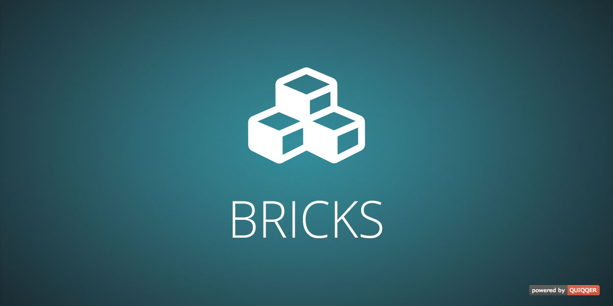

QUIQQER Bricks
========

Bricks are small blocks that you can set free on your website.

Within the template areas you can place all kinds of bricks, such as advertising banners, content bricks, 
contact data, news and blog entries, pictures and so on. 

In order to make it easier for you and so that you can design your website quickly 
and easily according to your own wishes, the bricks are at your disposal. Create own 
bricks of various types and insert them into the areas on your website.

With a few simple steps you can expand your website without extensive development knowledge.

Build your website like with building blocks

Package name:

    quiqqer/bricks

Features
--------

- Brick administration
- Different bricks can be assigned to one page
- Bricks can be created and managed for each project individually
- More than 20 flexible bricks are delivered
  - Create page lists in no time at all with the different brick lists
  - A lot of sliders

Installation
------------

The package name: quiqqer/bricks

Contribution
----------

- Project: https://dev.quiqqer.com/quiqqer/package-bricks
- Issue Tracker: https://dev.quiqqer.com/quiqqer/package-bricks/issues
- Source Code: https://dev.quiqqer.com/quiqqer/package-bricks/tree/master

Support
-------

If you have found an error or want improvements, please send an e-mail to support@pcsg.de.

License
-------

GPL-3.0+
