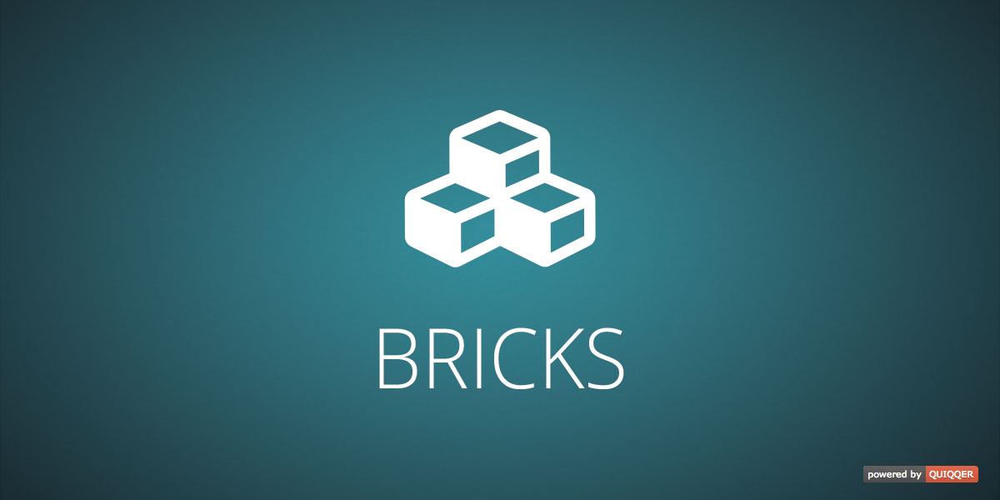

QUIQQER Bricks
========

Bricks are small blocks that you can set free on your website.

Within the template areas you can place all kinds of bricks, such as advertising banners, content bricks, 
contact data, news and blog entries, pictures and so on. 

In order to make it easier for you and so that you can design your website quickly 
and easily according to your own wishes, the bricks are at your disposal. Create own 
bricks of various types and insert them into the areas on your website.

With a few simple steps you can expand your website without extensive development knowledge.

Build your website like with building blocks

Package name:

    quiqqer/bricks

Features
--------

- Brick administration
- Different bricks can be assigned to one page
- Bricks can be created and managed for each project individually
- More than 20 flexible bricks are delivered
  - Create page lists in no time at all with the different brick lists
  - A lot of sliders

Installation
------------

The package name: quiqqer/bricks

Contribution
----------

- Project: https://dev.quiqqer.com/quiqqer/package-bricks
- Issue Tracker: https://dev.quiqqer.com/quiqqer/package-bricks/issues
- Source Code: https://dev.quiqqer.com/quiqqer/package-bricks/tree/master

For developer
------

When adding new bricks, please make sure the brick metadata and mockups are
consistent and high-quality:

- **Title**: Provide a clear title without the package name.
- **Description**: Describe precisely what the brick does. One sentence is
  usually not enough.
- **Settings**: If the brick has multiple settings, summarize them briefly with
  bullet points.
- **Images**: Provide at least one image.
  - **Main image (mockup)**: Ideally with a grey background and shown as a
    wireframe-style representation of the brick.
  - **Additional images (mockups)**: Screenshots are fine.
- **Image format**: All images should use a 3:2 aspect ratio and preferably not
  exceed 900x600 pixels.
- Use the recommended attribute in the `<brick ... recommended="1">` tag if the brick is easy to use 
  and recommended for new users.

More information about how to provide a brick and mockups:
https://dev.quiqqer.com/quiqqer/package-bricks/-/wikis/dev/bricks

Support
-------

If you have found an error or want improvements, please send an e-mail to support@pcsg.de.

License
-------

GPL-3.0+
