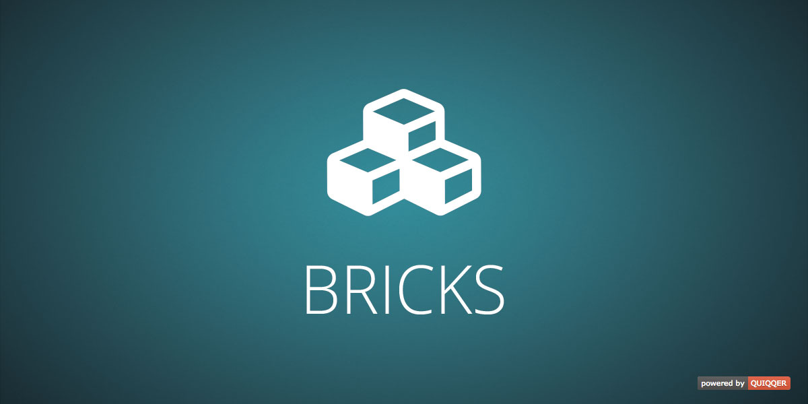

QUIQQER Bricks
========

Bricks are small blocks that you can set free on your website.

Within the template areas you can place all kinds of bricks, such as advertising banners, content bricks, 
contact data, news and blog entries, pictures and so on. 

In order to make it easier for you and so that you can design your website quickly 
and easily according to your own wishes, the bricks are at your disposal. Create own 
bricks of various types and insert them into the areas on your website.

With a few simple steps you can expand your website without extensive development knowledge.

Build your website like with building blocks


Package name:

    quiqqer/bricks


Features
--------

- Brick administration
- Different bricks can be assigned to one page
- Bricks can be created and managed for each project individually
- More than 20 flexible bricks are delivered
  - Create page lists in no time at all with the different brick lists
  - A lot of sliders


Installation
------------

The package name: quiqqer/bricks


Contribution
----------

- Project: https://dev.quiqqer.com/quiqqer/package-bricks
- Issue Tracker: https://dev.quiqqer.com/quiqqer/package-bricks/issues
- Source Code: https://dev.quiqqer.com/quiqqer/package-bricks/tree/master


For developer
------

When adding new bricks, please make sure the brick metadata and mockups are
consistent and high-quality:

- **Title**: Provide a clear title without the package name.
- **Description**: Describe precisely what the brick does. One sentence is
  usually not enough.
- **Settings**: If the brick has multiple settings, summarize them briefly with
  bullet points.
- **Images**: Provide at least one image.
  - **Main image (mockup)**: Ideally with a grey background and shown as a
    wireframe-style representation of the brick.
  - **Additional images (mockups)**: Screenshots are fine.
- **Image format**: All images should use a 3:2 aspect ratio and preferably not
  exceed 900x600 pixels.
- Use the recommended attribute in the `<brick ... recommended="1">` tag if the brick is easy to use 
  and recommended for new users.

More information about how to provide a brick and mockups:
https://dev.quiqqer.com/quiqqer/package-bricks/-/wikis/dev/bricks


### Brick categories

A brick definition may declare what it is good for, so another package can
offer a filtered choice of bricks without naming a control class:

```xml
<brick control="\QUI\SalesAgent\Controls\Agent" category="aiAgent">
```

`category` is a free vocabulary and accepts a comma separated list, so a
brick can belong to more than one. Declaring nothing is the normal case; an
uncategorised brick stays selectable everywhere.

The brick picker filters on it through two options, combined with **OR** - a
brick qualifies through its category *or* through its control being named
explicitly:

```xml
<setting name="agentBrickId" type="hidden"
         data-qui="package/quiqqer/bricks/bin/Controls/backend/BrickIdInput"
         data-qui-options-brickcategories="aiAgent"
>
```

`data-qui-options-brickcontrols` takes control class names the same way and
exists for the case "these two bricks as well", so no brick has to be given
a category just to be selectable somewhere. Setting neither option filters
nothing, which is the previous behaviour.

When the filter leaves nothing to pick, the picker says so instead of
showing "no results" - a caller that knows which brick is missing can
replace the text with `data-qui-options-emptytext`.

In PHP, `Utils::getBrickDefinitionsByCategory()` answers the related
question "can this system do X at all", by looking at the brick definitions
of all installed packages rather than at the bricks of a project.


### Passing parameters to a brick opened in a popup

A button that opens a brick in a popup can hand values over to that brick,
for example which package the visitor just clicked. Editors fill the button
setting *Attributes for the opened brick*; it is deliberately a second field
next to the button's own data attributes, so the two never mix.

The values travel as one JSON attribute and are applied by the render ajax:

```html
<button type="button"
        data-qui="package/quiqqer/components/bin/Controls/Button/OpenBrick"
        data-open-brick-id="233"
        data-brick-params='{"context":"Package: Starter"}'>
    Request
</button>
```

The same works from JavaScript, through the `brickParams` option:

```js
new BrickWindow({
    brickId: 233,
    brickParams: {context: 'Package: Starter'}
}).open();
```

**Every parameter is applied with the `param-` prefix** (see
`Utils::brickParamsFromRequest()` and `Utils::BRICK_PARAM_PREFIX`). A brick
reads `param-context`, never `context`. This is a security boundary, not a
naming style: `Brick::setSetting()` writes straight through to the control, so
an unprefixed passthrough would let a visitor overwrite real settings such as a
prompt or a recipient address. A brick opts in by reading the prefixed name;
one that reads nothing is unaffected.

A render carrying parameters is **not cached**: the values come from the client
and the brick cache is keyed by the settings hash, so caching would mint an
entry per distinct value.

Applying the prefix is idempotent, so a brick that hands its own parameters
on to a nested brick can pass them straight through: it holds them under the
prefixed name, and sending `param-context` yields `param-context`, not
`param-param-context`. Prefixing twice would not be rejected - the doubled
name passes the name rule - it would just quietly arrive where nothing reads
it.


Support
-------

If you have found an error or want improvements, please send an e-mail to support@pcsg.de.


License
-------

GPL-3.0+
